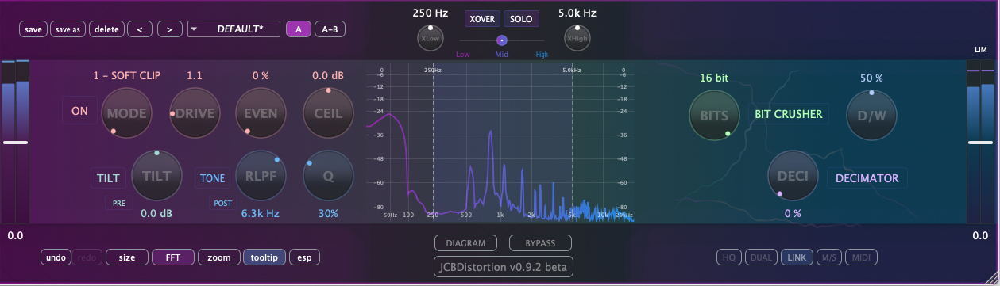
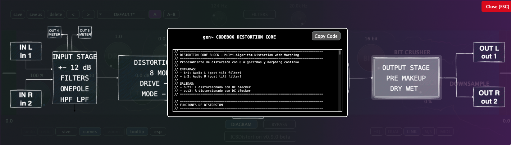

Plugin distorsionador desarrollado en gen~, exportado con [gen~ Plugin Export](https://github.com/Cycling74/gen-plugin-export) y finalizado con el framework C++ [JUCE](https://github.com/juce-framework/JUCE). Este plugin forma parte de un conjunto de herramientas didácticas que utilizo en la asignatura de Técnicas de Grabación y Masterización para Música Electroacústica del [MCE](https://katarinagurska.com/curso-of/master-de-composicion-electroacustica-mce/). Originalmente creado con JUCE 6 hace unos años, el proyecto ha evolucionado significativamente en su interfaz gráfica y funcionalidad gracias al desarrollo con Claude Code durante junio de 2025. Para más detalles técnicos, consulta [NOTAS.md](NOTAS.md).

## Instalación macOS
1. Descarga el archivo DMG desde la página de [Releases](https://github.com/cjitter/JCBDistortion/releases)
2. Abre el DMG y ejecuta el instalador
3. El instalador colocará automáticamente los tipos de plugins seleccionados en las ubicaciones correctas del sistema:
   - VST3: `/Library/Audio/Plug-Ins/VST3/`
   - AU: `/Library/Audio/Plug-Ins/Components/`
   - AAX: `/Library/Application Support/Avid/Audio/Plug-Ins/`

*Nota: El DMG está firmado y notarizado para macOS.*

## Requisitos del sistema

- macOS 10.12 o posterior
- Procesador Intel o Apple Silicon
- DAW compatible con VST3, AU o AAX
- Probado en: Pro Tools, Reaper, Logic, Ableton Live y Bitwig

## Compilación desde código fuente

### Requisitos previos
- Git, [CMake](https://cmake.org) 3.20 o posterior, compilador Apple Clang compatible con C++20 (incluido en Xcode 13 o superior).
- [JUCE](https://github.com/juce-framework/JUCE) 8.0.8 (se descarga automáticamente via FetchContent)
- **AAX SDK**, solo requerido para compilar formato AAX - disponible desde cuenta de desarrollador Avid, etc.

### Instrucciones de compilación

1. Clona el repositorio:
```bash
git clone https://github.com/cjitter/JCBDistortion.git
cd JCBDistortion
```

2. **Configuración del proyecto**:
```bash
# Configurar proyecto Debug (VST3 y AU)
cmake -B build-debug -DCMAKE_BUILD_TYPE=Debug

# Configurar proyecto Release (VST3 y AU)
cmake -B build-release -DCMAKE_BUILD_TYPE=Release

# Configurar proyecto Debug/Release con AAX (requiere AAX SDK y Pro Tools Developer instalado)
cmake -B build-debug -DCMAKE_BUILD_TYPE=Debug -DJUCE_BUILD_AAX=ON
```

**Nota sobre generadores**: Por defecto, CMake usa Unix Makefiles en macOS. También puedes especificar otros generadores:
- **Ninja** (más rápido): `cmake -B build -G Ninja`
- **Xcode** (IDE nativo): `cmake -B build -G Xcode`

**Nota sobre AAX**: Si configuras con la opción AAX habilitada, cuando compiles el plugin se instalará automáticamente en `/Applications/Pro Tools Developer/Plug-Ins/` para testing con Pro Tools Developer.

3. **Compilación**:
```bash
# Compilar el proyecto configurado
cmake --build build-debug    # Para Debug
cmake --build build-release   # Para Release
```

## Características principales

- **Distorsionador multimodal con 8 algoritmos seleccionables** (MODE 0-7): Soft Clipping, Sigmoid, Full/Half Wave Rectifier, Fuzz Exponential, Hyperbolic Tangent, Arctangent, Hard Clip
- **Control de ganancia de entrada (DRIVE)** de 1 a 50x para modular la intensidad de distorsión
- **Control de asimetría DC (EVEN)** de 0 a 1 para generar armónicos pares mediante offset DC variable
- **Bit Crusher configurable** de 3 a 16 bits con activador independiente (BIT CRUSHER)
- **Downsampler/Decimador** de 0 a 100% con activador dedicado (DOWNSAMPLE)
- **Filtros HPF/LPF** configurables (20Hz-20kHz) con botón activador (FILTERS)
- **Filtro Tilt** de ±6dB para balance espectral pre-distorsión
- **Control de techo (CEILING)** de -20 a +6 dB para limitar la salida
- **Trim de salida** de ±12dB para ajuste fino del nivel
- **Control Dry/Wet** (0-100%) para mezcla paralela post-procesamiento
- **Bypass verdadero** con botón dedicado
- **Analizador de espectro FFT profesional** 2048-point con toggle FFT/CURVES
- **Visualizador de curvas de distorsión** en tiempo real con respuesta dinámica
- **Medidores de entrada/salida** con gradiente visual RMS/Peak
- **5 Factory Presets** integrados (Ali, BrightLight, Midy, PlusSixAll, Spark)
- **Procesamiento estéreo completo** con parámetros unificados
- **Tooltips bilingües** conmutables (Español/Inglés)
- **Diagrama de bloques interactivo** con acceso al código GenExpr para estudio técnico



## Recursos

### Bibliografía técnica
- [Graham Wakefield & Gregory Taylor - *Generating Sound and Organizing Time*](https://cycling74.com/books/go)
- [Will C. Pirkle - *Designing Audio Effect Plugins in C++*](https://www.willpirkle.com)
- [Matthijs Hollemans - *The Complete Beginner's Guide to Audio Plug-in Development*](https://www.theaudioprogrammer.com/books/beginners-plugin-book)

## Testing con pluginval

Este proyecto incluye tests automáticos con [pluginval](https://github.com/Tracktion/pluginval) para validar el plugin.

### Configuración

- **Detección automática**: Si tienes pluginval instalado, CMake lo detectará automáticamente
- **Descarga automática**: Si no está instalado, se descargará automáticamente en la carpeta `tools/`
- Para desactivar la descarga automática:
  ```bash
  cmake -B build -DPLUGINVAL_AUTO_DOWNLOAD=OFF
  ```

### Ejecutar los tests

```bash
# Entra al directorio de build (el mismo nombre que usaste después de -B al configurar)
# Por ejemplo: si usaste "cmake -B build", entonces:
cd build

# Ejecutar todos los tests de pluginval con salida detallada
# Usa -C Release o -C Debug según cómo compilaste el plugin
# Nota: Los tests completos pueden tardar varios minutos
ctest -C Release -R pluginval -V
```

Los tests validan los formatos VST3 y AU del plugin.

## Por hacer

- Añadir oversampling opcional para evitar aliasing en modos extremos.
- Crear versión simplificada para Max for Live.
- Portar el modelo a SuperCollider como UGen personalizado.

---

*© 2025 Juan Carlos Blancas – JCBDistortion v0.9.0 beta*
