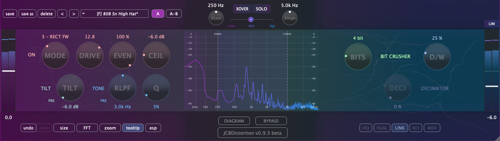
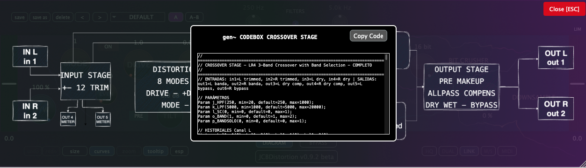

Plugin distorsionador desarrollado en gen~, exportado con [gen~ Plugin Export](https://github.com/Cycling74/gen-plugin-export) y finalizado con el framework C++ [JUCE](https://github.com/juce-framework/JUCE). Este plugin forma parte de un conjunto de herramientas didácticas que utilizo en la asignatura de Técnicas de Grabación y Masterización para Música Electroacústica del [MCE](https://katarinagurska.com/curso-of/master-de-composicion-electroacustica-mce/). Originalmente creado con JUCE 6 hace unos años, el proyecto ha evolucionado significativamente en su interfaz gráfica y funcionalidad gracias al desarrollo con Claude Code durante junio de 2025. Para más detalles técnicos, consulta [NOTAS.md](NOTAS.md).

## Instalación macOS
1. Descarga el archivo DMG desde la página de [Releases](https://github.com/cjitter/JCBDistortion/releases)
2. Abre el DMG y ejecuta el instalador
3. El instalador colocará automáticamente los tipos de plugins seleccionados en las ubicaciones correctas del sistema:
   - VST3: `/Library/Audio/Plug-Ins/VST3/`
   - AU: `/Library/Audio/Plug-Ins/Components/`
   - AAX: `/Library/Application Support/Avid/Audio/Plug-Ins/`

*Nota: El DMG está firmado y notarizado para macOS.*

## Requisitos del sistema

- macOS 10.12 o posterior
- Procesador Intel o Apple Silicon
- DAW compatible con VST3, AU o AAX
- Probado en: Pro Tools, Reaper, Logic, Ableton Live y Bitwig

## Compilación desde código fuente

### Requisitos previos
- Git, [CMake](https://cmake.org) 3.20 o posterior, compilador Apple Clang compatible con C++20 (incluido en Xcode 13 o superior).
- [JUCE](https://github.com/juce-framework/JUCE) 8.0.8 (se descarga automáticamente via FetchContent)
- **AAX SDK**, solo requerido para compilar formato AAX - disponible desde cuenta de desarrollador Avid, etc.

### Instrucciones de compilación

1. Clona el repositorio:
```bash
git clone https://github.com/cjitter/JCBDistortion.git
cd JCBDistortion
```

2. **Configuración del proyecto**:
```bash
# Configurar proyecto Debug (VST3 y AU)
cmake -B build-debug -DCMAKE_BUILD_TYPE=Debug

# Configurar proyecto Release (VST3 y AU)
cmake -B build-release -DCMAKE_BUILD_TYPE=Release

# Configurar proyecto Debug/Release con AAX (requiere AAX SDK y Pro Tools Developer instalado)
cmake -B build-debug -DCMAKE_BUILD_TYPE=Debug -DJUCE_BUILD_AAX=ON
```

**Nota sobre generadores**: Por defecto, CMake usa Unix Makefiles en macOS. También puedes especificar otros generadores:
- **Ninja** (más rápido): `cmake -B build -G Ninja`
- **Xcode** (IDE nativo): `cmake -B build -G Xcode`

**Nota sobre AAX**: Si configuras con la opción AAX habilitada, cuando compiles el plugin se instalará automáticamente en `/Applications/Pro Tools Developer/Plug-Ins/` para testing con Pro Tools Developer.

3. **Compilación**:
```bash
# Compilar el proyecto configurado
cmake --build build-debug    # Para Debug
cmake --build build-release   # Para Release
```

## Características principales (v1.0.0)

- Distorsión multimodal: 8 algoritmos seleccionables (Soft Clip, Sigmoid, Full/Half Rectifier, Fuzz Exp., Tanh, Arctan, Hard Clip).
- Ganancia de entrada (DRIVE) de 1× a 50× y asimetría (EVEN) con skew dependiente de polaridad → armónicos pares controlables y sin DC.
- Filtro Tilt: ±6 dB, con posición Pre/Post Distorsión y morph continuo.
- Filtro Tone (RLPF resonante): Q 0.707–16, conmutación Pre/Post, compensación de fase en Dry y suavizado de parámetros.
- Crossover LR4 de 3 bandas con puntos ajustables (20 Hz–1 kHz / 1–20 kHz) y compensación de fase en la ruta Dry.
- Gestión de banda: selección continua y Solo de banda en Wet, manteniendo Dry full-range.
- Bit Crusher (2–16 bits) con cuantización por round, dc-block y mezcla conmutada.
- Downsampler con latch estable y reset limpio al activar (1–100×).
- Output: ceiling ajustable (−20 a +6 dB) + limitador de seguridad opcional (−0.1 dB), trim ±12 dB, mezcla Dry/Wet.
- Pipeline modular: Input → Crossover → Distorsión → Efectos → Output (fácil de depurar/extender).
- Robustez numérica: smoothing crítico (incl. MODE), fixdenorm en biquads y bypass suavizado compatible con Pro Tools.
- Analizador FFT 2048 pt con líneas de crossover arrastrables.
- Curvas de distorsión en tiempo real.
- Medidores In/Out RMS/Peak.
- Tooltips bilingües (ES/EN).
- Diagrama de bloques interactivo con acceso a GenExpr (Max).



## Recursos

### Bibliografía técnica
- [Graham Wakefield & Gregory Taylor - *Generating Sound and Organizing Time*](https://cycling74.com/books/go)
- [Will C. Pirkle - *Designing Audio Effect Plugins in C++*](https://www.willpirkle.com)
- [Matthijs Hollemans - *The Complete Beginner's Guide to Audio Plug-in Development*](https://www.theaudioprogrammer.com/books/beginners-plugin-book)

## Por hacer

- Migrar de Plugin Export a la exportación C++ de RNBO.
- Implementar oversampling con el módulo DSP de JUCE.
- Añadir modos dual y M/S.
- Integrar mapeo MIDI.
- Portar a SuperCollider los bloques de GenExpr o crear un UGen dedicado.

---

*© 2025 Juan Carlos Blancas – JCBDistortion v1.0.1*
